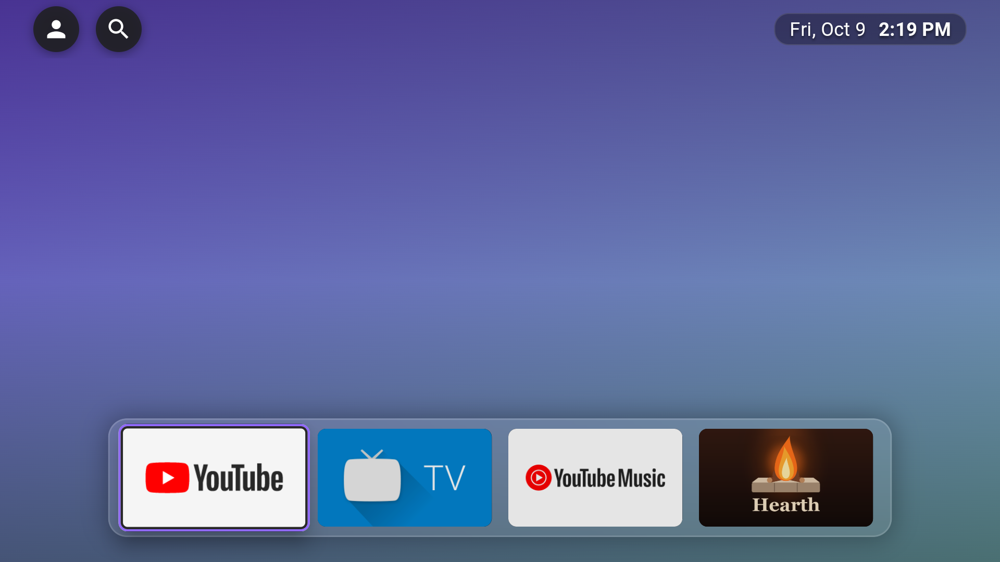
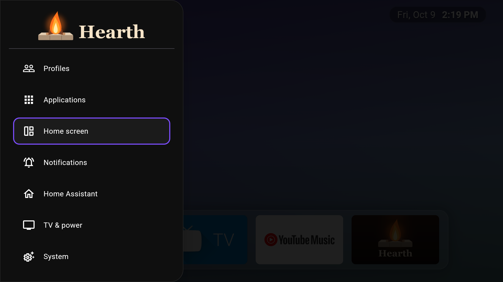
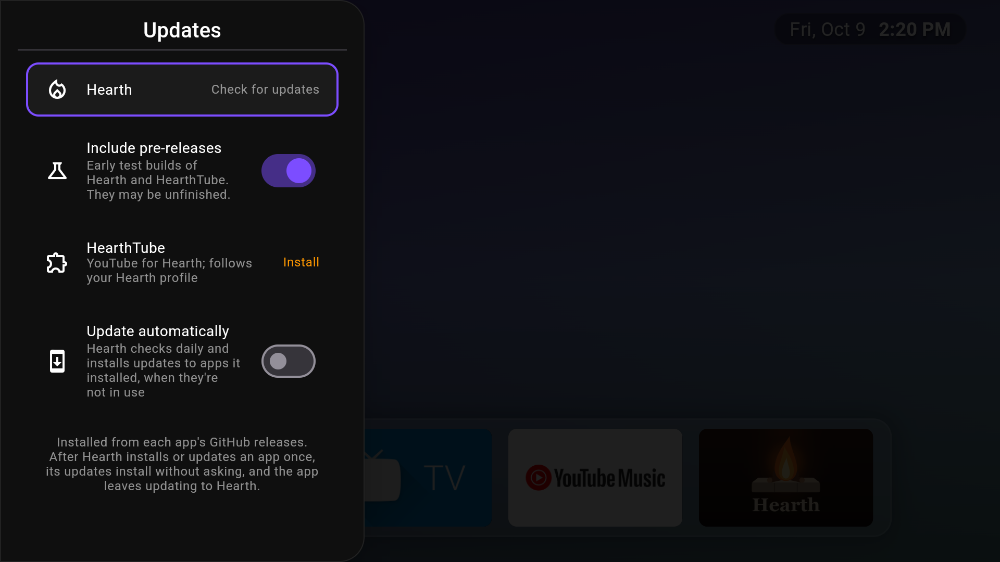
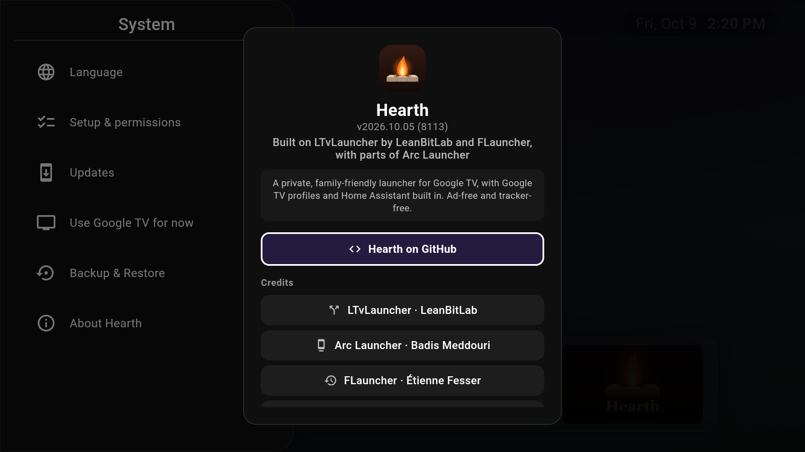

<p align="center">
  
</p>

<h1 align="center">Hearth</h1>

<p align="center">
  A private, family-friendly home screen for Google TV.<br>
  No ads, no tracking, no recommendations: your apps, your profiles, and Home Assistant built in.
</p>

<p align="center">
  <a href="https://github.com/theSiegs/Hearth/releases/latest"></a>
  <a href="LICENSE"></a>
</p>

> [!WARNING]
> **Early development.** Hearth is a work in progress, built and tested on a single Google TV. Expect rough edges,
> breaking changes between versions (including the app id), and documentation that is still a draft. It isn't ready
> for general use yet.

---

## Why Hearth

Google TV's own home screen is mostly ads and "for you" rows. Hearth replaces it with a calm home screen that shows
only what you put there, and keeps working with the parts of Google TV that families rely on: profiles, kids
profiles, Family Link screen time, and the Google Assistant.

<p align="center">
  
  
</p>
<p align="center">
  
  
</p>

## Features

**Home screen**
- A wallpaper-first home with a frosted **Favorites dock**, **Continue Watching** with cover art, and your app
  sections below.
- Wallpapers: Bing's photo of the day, your own pictures (per profile), gradients, or plain black.
- Seven card styles, accent colours, and row titles that stay readable on any wallpaper.
- **Search** across streaming services, opening titles straight in the app that has them.

**Google TV profiles**
- Follows Google TV's own profiles: each profile gets its own home layout, wallpaper and Continue Watching.
- **Profile Pairing**: opening Netflix, Disney+, Apple TV, HBO Max or Paramount+ from Hearth picks the matching
  profile in that app, and can type that profile's PIN for you.
- **Lock Profile** with Google TV's own profile lock, from Settings, the remote, or automatically when the TV
  sleeps.

**Families**
- Works with Family Link: Hearth gets out of the way of Google TV's bedtime and screen time screens.
- **Hearth on other profiles** puts Hearth (and HearthTube) on kids' profiles and keeps it there.
- A parent PIN for the settings that matter in kids' profiles.

**Home Assistant**
- Pop-up notifications over any app, with live camera views and action buttons (doorbell, laundry, …).
- A dashboard panel one press away.
- Reports what the TV is doing (app, now playing, profile, kids screen time) to a webhook for automations.

**The remote**
- Remap buttons (press and hold) to apps, inputs, profile switch or lock, search, sleep, or Home Assistant scenes and
  scripts.
- The Home button reliably opens Hearth (the *Home Button Fix*).

**Also**
- Weather in the top bar (Open-Meteo, or the Breezy Weather app), notifications panel, TV input switching,
  idle sleep, daily automatic backups, and self-updates from GitHub releases.
- 14 languages.

## Install

Hearth isn't on the Play Store, and releases are early development builds. Install the APK from the
[latest release](https://github.com/theSiegs/Hearth/releases/latest):

| File | For |
|---|---|
| `Hearth-arm64-v8a-release.apk` | Most current Google TV devices (Chromecast with Google TV, onn 4K, Nvidia Shield) |
| `Hearth-armeabi-v7a-release.apk` | Older 32-bit devices |
| `Hearth-universal-release.apk` | Either, if you're not sure (larger) |

Sideload it with the Downloader app (enter the release APK's URL) or from a computer:

```sh
adb install Hearth-arm64-v8a-release.apk
```

Then open Hearth: its first-run setup walks you through what it needs from Android, one screen at a time, and opens
the right Android screen for each. Run it again from **Settings → System → Set up Hearth**. See the
[user guide](docs/user-guide.md) for details.

Hearth is developed and tested on Google TV with Android 14. It may run on other Android TV devices, but the
profile and kids features need Google TV.

## Companion app: HearthTube

[HearthTube](https://github.com/theSiegs/HearthTube) is an ad-free YouTube client for TV that works with Hearth: it
follows Hearth's profiles, kids settings and wallpaper. Hearth can install and update it for you.

## Privacy

Hearth has no analytics, ads or trackers, and no account. It only connects to the internet for the things listed in
[docs/privacy.md](docs/privacy.md) (wallpaper, weather, search artwork, updates, and your own Home Assistant), and
it explains every Android permission it asks for.

## Documentation

- [User guide](docs/user-guide.md): setup and every feature
- [Home Assistant](docs/home-assistant.md): notifications, dashboard panel and status webhook
- [Privacy](docs/privacy.md): what Hearth sends where, and its permissions
- [Development](docs/development.md): building, testing and releasing
- [Provider contract](docs/provider-contract.md): the interface HearthTube (or another app) reads
- Design notes in [docs/design](docs/design)

## Credits

Hearth is built on open-source work:

- [FLauncher](https://gitlab.com/flauncher/flauncher) by Étienne Fesser, the original Flutter launcher for
  Android TV;
- [FLauncher](https://github.com/osrosal/flauncher) as continued by Oscar Rojas;
- [LTvLauncher](https://github.com/leanbitlab-org/LtvLauncher) by LeanBitLab, the project Hearth started from;
- [Arc Launcher](https://github.com/meddouribadis/arclauncher), whose dock and performance work Hearth adapted.

Search artwork comes from [TMDB](https://www.themoviedb.org). Hearth uses the TMDB API but is not endorsed or
certified by TMDB.

## License

Hearth is free software under the [GNU General Public License v3.0](LICENSE), like the projects it builds on.
Hearth is developed with AI assistance.
